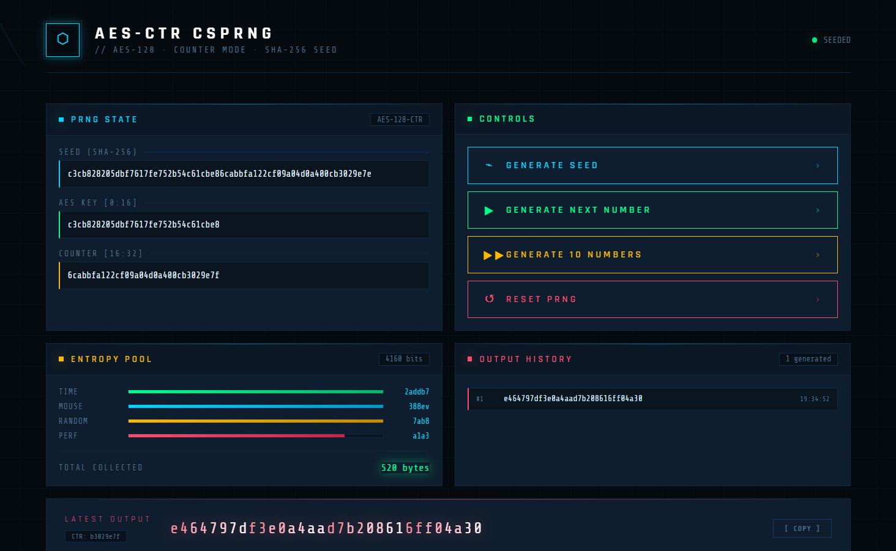
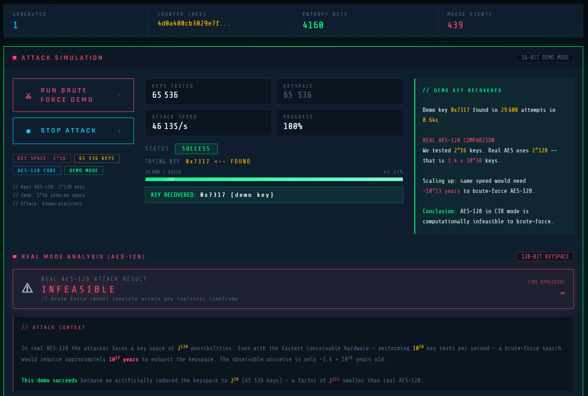
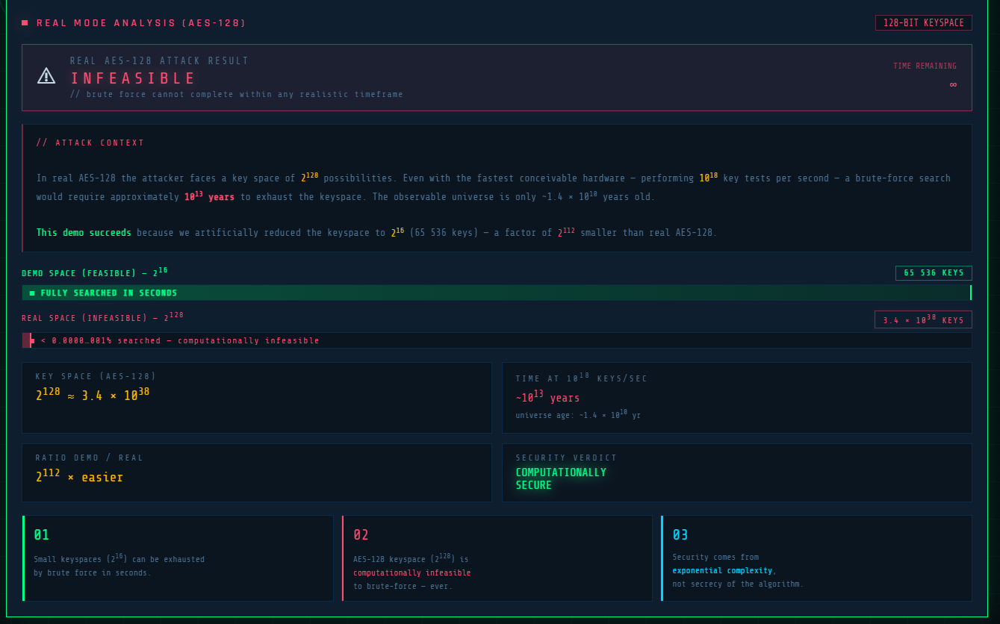

# AES-128 CSPRNG

> Générateur de nombres pseudo-aléatoires cryptographiquement sûr basé sur AES-128 en mode CTR — implémenté from scratch en Python.

## 🔴 Démo interactive en ligne

[](https://bouhadfane-elbatoul.github.io/aes-csprng/demo-full.html)

**👉 [Cliquer ici pour voir la démo](https://bouhadfane-elbatoul.github.io/aes-csprng/demo-full.html)**

---

## Aperçu

### Interface principale — PRNG State & Controls


### Simulation d'attaque brute-force (mode démo 2¹⁶)


### Analyse de sécurité AES-128 (espace réel 2¹²⁸)

---

## Architecture

```
seed (256 bits)
  ├── key     = seed[0:16]   (128 bits)
  └── counter = seed[16:32]  (128 bits)
        ↓
block = AES_encrypt(key, counter)
counter += 1
```

## Structure du projet

```
aes-csprng/
├── src/
│   ├── aes_core.py       # AES-128 from scratch
│   ├── csprng.py         # Générateur AES-CTR
│   ├── entropy.py        # Pool d'entropie SHA-256
│   ├── nist_tests.py     # Tests NIST SP 800-22
│   └── demo.py           # Script démo CLI
├── tests/
│   ├── test_aes.py       # Vecteurs officiels NIST
│   └── test_csprng.py    # Tests du générateur
├── demo/
│   ├── index.html        # Page d'accueil
│   └── demo-full.html    # Visualisation interactive
└── docs/
    ├── rapport.pdf
    └── images/
```

## Lancer la démo CLI

```bash
python -m src.demo
```

## Lancer les tests

```bash
pip install pytest
pytest tests/ -v
```

## Résultats NIST SP 800-22

| Test | Bits testés | p-value | Résultat |
|------|------------|---------|---------|
| Frequency Monobit | 20 000 | 0.755 | PASS ✓ |
| Runs Test | 20 000 | 0.534 | PASS ✓ |

## Sécurité

- Clé AES 128 bits
- Compteur 128 bits — période 2¹²⁸ blocs
- Reseeding automatique après 2⁴⁸ blocs
- Seed dérivé via SHA-256 depuis 6 sources d'entropie

## Auteurs

**Réalisé par :** Bouhadfane Elbatoul 

**Encadré par :** Dr Bouchoucha Lydia

> École supérieure en Sciences et Technologies de l'Informatique et du Numérique (ESTIN)
